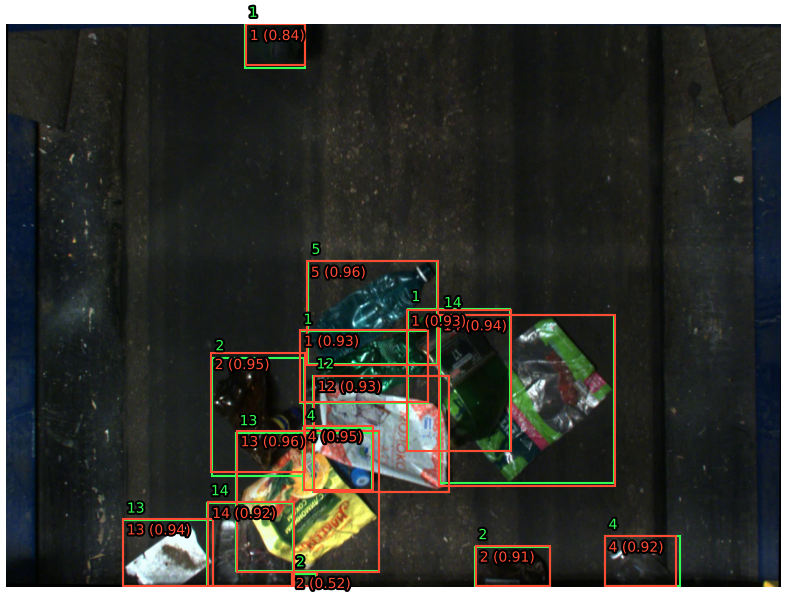

#  Детекция пластикового мусора на конвейерной ленте

**Заказчик:**  
Renue - IT-компания из Екатеринбурга, разрабатывает на заказ высоконагруженные и отказоустойчивые решения для крупных российских заказчиков, для бизнеса и государства.

**Цель проекта:** разработать модель, которая сможет распознавать различные виды отходов на основании изображений с конвейера. Эта автоматизированная система поможет оптимизировать процесс сортировки и сократить затраты на ручную сортировку.

**Описание данных:** набор данных содержит изображения, снятые с камер, установленных над сортировочным конвейером на перерабатывающем заводе.

**Метрика**: `mAP` (Mean Average Precision)

### Результаты
Пример работы модели (зеленый - ground truth, красный - predict):

- Лучшая модель - `YOLO11m`.
- На датасете с исправленной разметкой на валидационной выборке получена метрика `mAP` **0.8710**.  
- На оригинальном датасете `mAP` **0.8488**.

### Stack
`ultralytics`, `torch`, `torchvision`, `albumentations`, `pillow`, `opencv`.